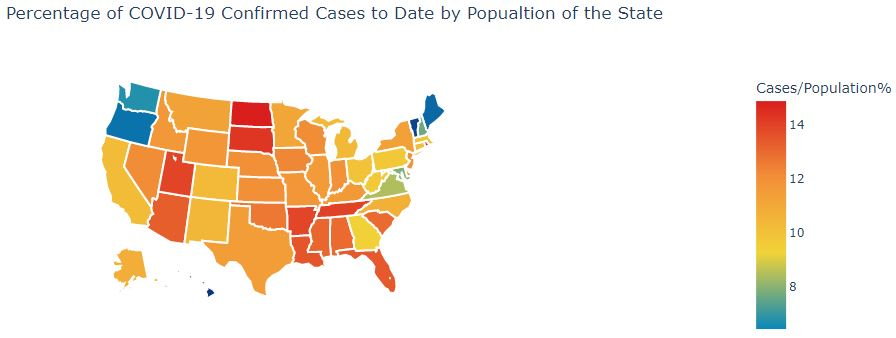
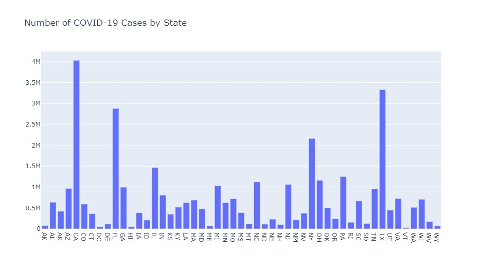
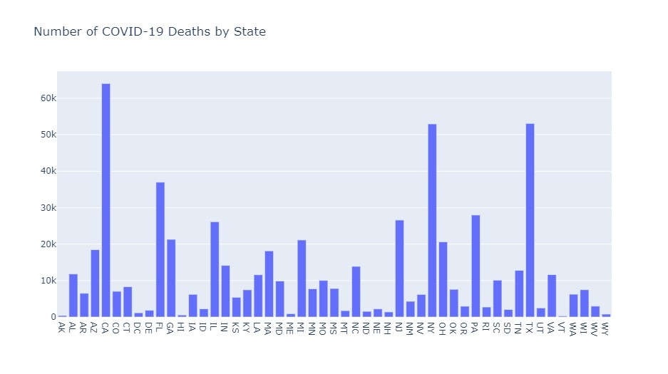
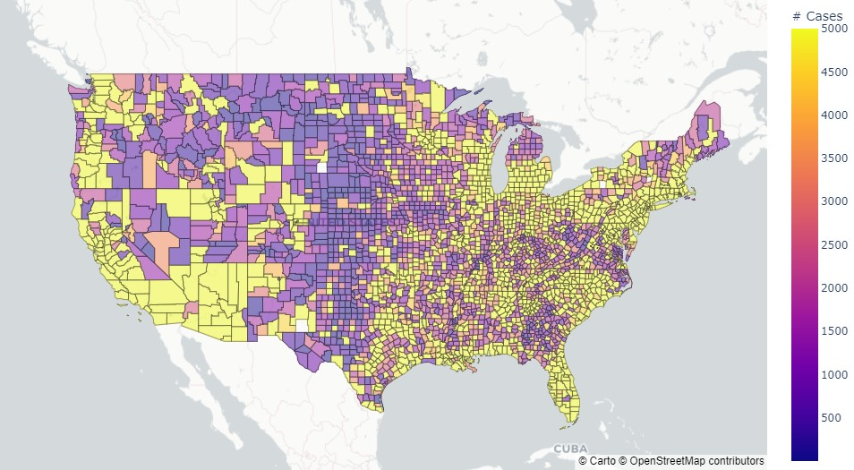

# ds_py_covid_analysis
**_<ins>Overview</ins>_:** Data Science project in Python to analyze COVID-19 data

### Description

Many countries across the globe have been dealing with the COVID-19 pandemic. This project explores real-time Covid-19 dataset from the USA and generates insights.

**Goals:**

* To visualize in real-time the trends in COVID-19 infection and death rates across the US.

* Identify hotspots and visualize trends specific to current hotspots states in the country.

* Make observations on current COVID-19 infections in current hotspots.

**Dataset:**

Focused only on the U.S. there are three datasets sourced from [USA Facts](https://usafacts.org/)

1. **covid_county_population_usafacts.csv** - population by county across all states

2. **covid_confirmed_usafacts.csv** - confirmed COVID-19 cases by the county beginning from Jan 22, 2020 to the current date

3. **covid_deaths_usafacts.csv** - confirmed COVID-19 deaths by the county beginning from Jan 22, 2020 to the current date

### Exploratory Data Analysis (EDA)

* Unique key = FIPS code for each location

* Merged the 3 datasets (listed above)

* Inspected merged data for overall structure, type, nulls and missing values

* Addressed conflicts in merged data

### Results

* Visualized infections by state and county to identify hotspots, perform trend analysis, and make observations in real-time with latest dataset

* Initially, New York and New Jersey were the hotspots, from March through May 2020

* Afterwards, an uptick can be observed in covid-19 cases in southeast and southwest  states, notably Florida, Texas, Arizona and California

## Important Visualizations

